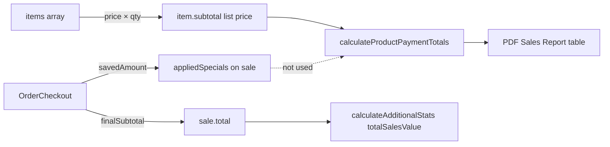
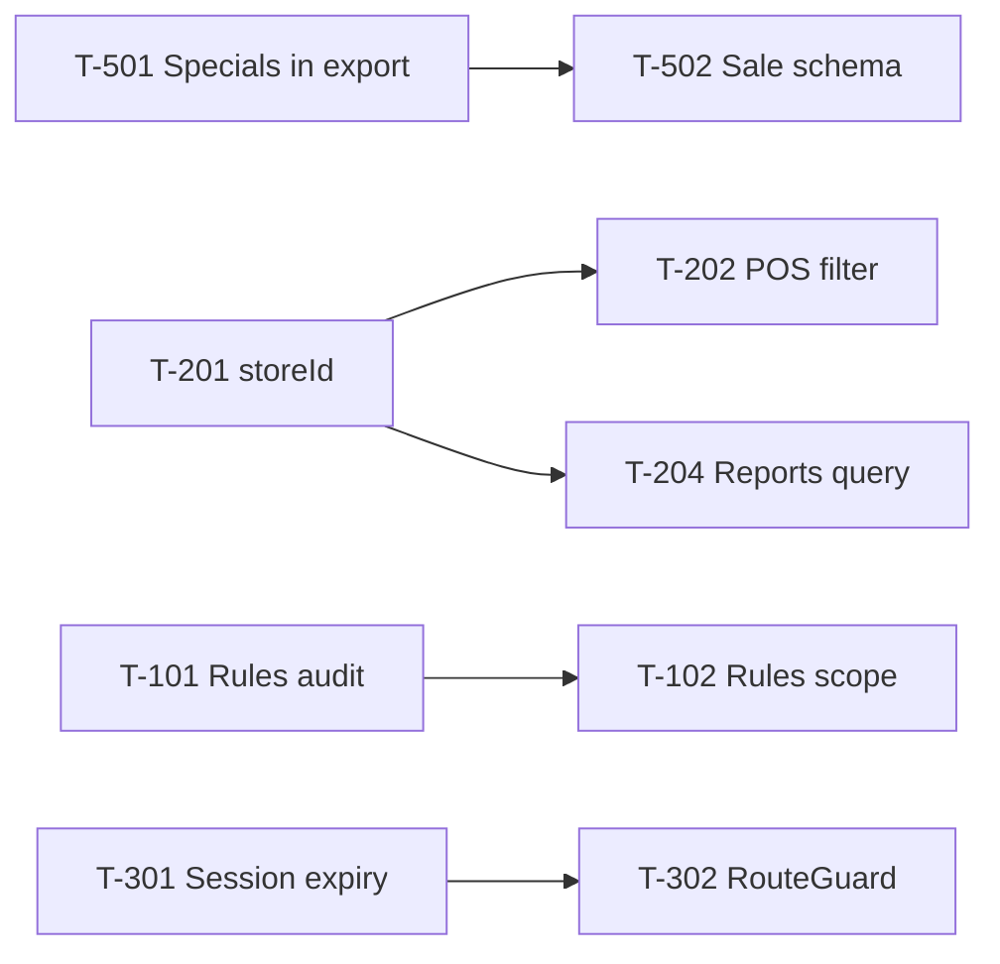

# iBean — Tightening Tracker

Living checklist for hardening iBean after the architecture review (May 2026). Update status and notes as each item is fixed.

**Related docs:** [`ibean_architecture_and_docs.md`](./ibean_architecture_and_docs.md) · [`.cursorrules`](./.cursorrules)

---

## Product priorities (team direction)

| Area | Stance |
|------|--------|
| **Store login** (Firebase email/password) | Must stay secure — this is the real perimeter. |
| **Staff 4-digit PIN** | Operational convenience for baristas, not a security boundary. Current client-side check is **acceptable**; do not invest in server-side PIN hardening unless requirements change. |
| **Data model & order flow** | **Main focus** — tighten how carts become `sales` documents and how reports/exports consume them. NoSQL drift here causes real business bugs (see **T-501**). |
| **Multi-store `storeId`** | Important where Chillzone runs more than one register dataset. |

---

## Architecture direction (why we’re tightening — not rewriting)

### You do not need to rebuild because it’s Firebase

What likely happened with iBean is normal for first-generation operational software:

- The system evolved quickly.
- Business rules expanded.
- Edge cases accumulated.
- Financial logic became fragmented.

That pattern is expected. **The stack is not the problem.**

### Biggest risk right now

Not Firebase. Not Next.js.

**The real risk is mixing business logic into UI components everywhere** — which happens constantly in fast-moving Next.js apps.

Symptoms we already see (or are close to):

| Symptom | Example in iBean |
|---------|------------------|
| Totals calculated in React state | `OrderCheckout` specials + VAT in `useMemo` |
| Export logic recalculating independently | `calculateProductPaymentTotals` vs checkout (**T-501**) |
| Discounts transformed differently | UI `savedAmount` vs stored `items[].subtotal` at list price |
| Derived values duplicated | `subtotalBeforeDiscounts`, `totalDiscount`, `total`, line subtotals |
| Firebase docs storing partial computations | `sales` mixes raw lines + net `total` without aligned line amounts |

That fragmentation creates **inconsistency** — the specials/export bug is one concrete outcome.

### What to do instead: a domain layer (even inside Next.js)

Introduce shared, pure functions — **one source of truth** — and route all money paths through them:

```
utils/pricing/          # (or lib/pricing/ — same idea)
  calculateOrder.ts
  calculateDiscounts.ts   # specials, vouchers
  calculateTax.ts
  buildSaleDocument.ts    # shape for Firestore
  aggregateSalesReport.ts # exports, PDF, dashboards
```

**Everything must call these:**

- Cart UI (`Products`, `OrderCheckout`)
- Checkout (`ConfirmOrder`)
- Exports / PDF (`reportCalculations`, reports page)
- Reporting & dashboards
- Receipts (if added later)

Tracker items **T-501**, **T-502**, and future pricing work should converge here — not another one-off fix in a component.

### Firebase: store transactional truth, derive the rest

Avoid treating Firestore as a cache of **pre-baked report numbers**.

**Prefer storing raw transactional truth**, for example:

```json
{
  "items": [{ "id", "name", "quantity", "unitPriceCents" }],
  "discounts": [{ "type", "name", "amountCents", "source": "special" }],
  "payments": [{ "method", "amountCents" }],
  "storeId": "...",
  "staffId": "...",
  "createdAt": "..."
}
```

Then:

- **Reports and exports** run through the same calculation/aggregation engine as checkout.
- Historical exports can be **recomputed** if rules change (with a documented rule version if needed).

If we keep storing derived fields (`total`, `totalDiscount`), they must be **reproducible** from stored inputs — never the only place a number exists.

### Money: avoid floating-point drift

Hidden POS/accounting issue: JavaScript `0.1 + 0.2` style math on rand amounts.

**Target approach:**

- Store and calculate in **integer cents** where possible (`R 19.99` → `1999`).
- Convert to decimal **only for display** (`.toFixed(2)`).
- Apply the same rule in checkout, Firestore writes, and exports.

Until a full cents migration, new domain functions should still round explicitly and document rounding policy (per line vs per order).

---

## How to use this document

| Status | Meaning |
|--------|---------|
| ✅ | Done — verify in prod/staging if applicable |
| 🔄 | In progress |
| ⬜ | Not started |
| ⏸ | Blocked / needs decision |

**Priority:** P0 = security or data corruption risk · P1 = wrong reports or multi-store bleed · P2 = reliability/UX · P3 = maintainability

When closing an item: add **PR/commit**, **verified by**, and a one-line **resolution** under Notes.

---

## Summary

| Priority | Open | Done | Won't fix |
|----------|------|------|-----------|
| P0 (data / reports) | 0 | 2 | — |
| P0 (store security) | 2 | 0 | — |
| P1 | 3 | 2 | — |
| P2 | 6 | 0 | — |
| P3 | 4 | 1 | 1 |
| **Total** | **15** | **5** | **1** |

*Last updated: 2026-05-29*

---

## Completed

### T-000 — Remove legacy UI components ✅

**Resolution:** Deleted unused popup-era components that depended on missing `StoreContext` and broken imports.

| Removed |
|---------|
| `app/components/Menu.jsx` |
| `app/components/Sidebar.jsx` |
| `app/components/Dashboard.jsx` |
| `app/components/Sales.jsx` |
| `app/components/Refunds.jsx` |
| `app/components/ManageProducts.jsx` |

**Verify:** `npm run build` passes. Active routes use `app/dashboard/*/page.jsx` and POS components only.

---

## P0 — Order flow & reporting (highest business impact)

### T-501 — Specials discounted at checkout but full amounts in PDF export ✅

**Reported:** Manager/export PDF shows product revenue **without** specials discounts, while checkout and stored `sale.total` **do** include discounts. Line items still “add” at full catalog price in the export table.

**Symptom for baristas/managers:**

- POS checkout: subtotal → specials lines → lower **Total** (correct).
- Firestore sale: `total` matches what customer paid; `appliedSpecials` and `totalDiscount` are saved.
- **Export to PDF** (`/dashboard/reports` → “Export to PDF”): **Sales Report** table per product sums **undiscounted** line `subtotal` values — specials are **not shown** and **not subtracted**.

**Root cause (three-layer mismatch):**



| Layer | What happens |
|-------|----------------|
| **Checkout** (`OrderCheckout.jsx`) | Discount computed in UI; `totalPrice` passed to confirm = after specials. |
| **Persist** (`ConfirmOrder.jsx`) | `items[].subtotal` = **list price × quantity** (no special allocation). Also writes `appliedSpecials`, `subtotalBeforeDiscounts`, `totalDiscount`, `total` (net). |
| **Export** (`reportCalculations.js` → `calculateProductPaymentTotals`) | Aggregates **only** `sale.items[].subtotal` by product name. **Ignores** `appliedSpecials`, `totalDiscount`, `subtotalBeforeDiscounts`. |

**Code references:**

- Sale write — list-price line subtotals: `ConfirmOrder.jsx` (`items` map, ~388–398).
- Export aggregation: `utils/reportCalculations.js` (`calculateProductPaymentTotals`, lines 1–20).
- PDF uses that aggregation: `app/dashboard/reports/page.jsx` (`handleExportToPdf` → `salesTotals` table, ~415–436).

**Why totals can look “half wrong”:**

- **Summary Statistics** in the same PDF use `sale.total` (net) via `calculateAdditionalStats` → **Total sales value** can be **lower** than the sum of the **Sales Report** product rows.
- Reconciling the PDF by hand will not balance.

**Fix direction (pick one strategy and apply everywhere):**

1. **Export-only (quick):** In `calculateProductPaymentTotals`, for each sale with `totalDiscount > 0`, allocate discount to lines (pro-rata by `subtotal`) **or** add a PDF section **“Promotions / specials”** listing `appliedSpecials` and subtract `totalDiscount` from a gross subtotal row.
2. **Write-time (tighter model):** When saving a sale, persist **net** line amounts (or `lineDiscount` per item) so any consumer of `items[]` sees economic reality.
3. **Canonical header (NoSQL pattern):** Treat `subtotalBeforeDiscounts`, `totalDiscount`, `total`, and `appliedSpecials[]` as source of truth; ban summing raw `items[].subtotal` for revenue reports without adjustment.

**Acceptance criteria:**

- [x] PDF / on-screen product table uses **net** revenue (`allocateNetToLineItems` + `aggregateProductPaymentTotals`).
- [x] Promotions summary on reports UI + PDF caption.
- [x] Architecture doc updated for `sales` + pricing layer.

**Resolution:** Added `utils/pricing/`; reports aggregate net per line; promotions summary shown. Verify on a day with live specials in staging.

**Notes:** 2026-05-29 — Wave 1.

---

### T-502 — Tighten sale document schema & order → Firestore contract ✅

**Problem:** Order flow is loose: cart in `localStorage`, specials computed only in checkout UI, persisted `items` do not reflect promotions, and downstream code (reports, AI home, future features) each interpret sales differently. Classic NoSQL consistency drift.

**Current `sales` shape (simplified):**

| Field | Meaning | Used by exports? |
|-------|---------|------------------|
| `items[]` | List price line subtotals | ✅ PDF product table (incorrect for promos) |
| `appliedSpecials[]` | Promo breakdown + `savedAmount` | ❌ PDF |
| `subtotalBeforeDiscounts` | Pre-promo gross | ❌ PDF |
| `totalDiscount` | Sum of specials | ❌ PDF |
| `total` | Amount paid | ✅ summary stats |
| `voucher` | Voucher promos | Partial (`calculateVoucherStats`) |

**Acceptance criteria:**

- [x] `buildSaleDocument()` + `calculateOrderTotals()` in `utils/pricing/`.
- [x] `ConfirmOrder`, `OrderCheckout`, `reportCalculations` use pricing module.
- [ ] Optional follow-up: persist net line amounts on `items[]` (still list price + header discounts).

**Resolution:** Single builder for Firestore sales; checkout totals from `calculateOrderTotals`. Reports still allocate discount pro-rata from `sale.total`.

**Notes:** 2026-05-29 — Wave 1.

---

## P0 — Store security (Firebase account perimeter)

### T-101 — Firestore rules: align with real app behaviour ⬜

**Problem:** Documented rules in `ibean_architecture_and_docs.md` may not match production. If rules are too tight, reports/home cannot read `sales`; if too loose, store accounts see more than intended. **Staff PIN collection readability is out of scope** (accepted risk).

**Affected:** Firebase console rules, all read/write paths.

**Acceptance criteria:**

- [ ] Audit **actual** rules in Firebase console vs this tracker.
- [ ] `sales` / `refunds`: read scoped to owning store (see T-102).
- [ ] Manager-only writes enforced server-side where practical (`products`, `categories`, `specials`, `staff` writes).
- [ ] Update `ibean_architecture_and_docs.md` rules section to match production.

**Notes:**

---

### T-102 — Server-side store scoping in security rules ⬜

**Problem:** Authorization is mostly client-side (`RouteGuard`, sidebar). Any authenticated store user can potentially read/write another store’s data depending on rules.

**Affected:** All collections with `storeId` or store identity.

**Acceptance criteria:**

- [ ] Define canonical store key (see T-201) and use it in rules, e.g. `request.auth.token.email` or custom claim.
- [ ] Queries from client include filters that rules allow (composite indexes if needed).
- [ ] Document index requirements in architecture doc.

**Depends on:** T-201

**Notes:**

---

## Won't fix (accepted)

### T-103 — Staff PIN: server-side verification ⛔

**Decision:** Staff codes are for shift identification on a trusted store device, not theft prevention. Barista-facing threat model; **store Firebase login** remains the security boundary. Keep current `StaffAuthModal` + `localStorage` flow unless compliance requirements change.

**Notes:** 2026-05-29 — explicit product decision.

---

## P1 — Data integrity & multi-store correctness

### T-201 — Normalize `storeId` across the app ✅

**Decision:** Canonical `storeId` = **Firebase Auth `user.email`** (matches existing `sales` / reports).

**Implemented:**

- `utils/storeId.js` — `getStoreId()`, `getStoreIdCandidates()`, `documentBelongsToStore()` (legacy **uid** still matches).
- `utils/stores.js` — `CHILLZONE_STORES` for reports dropdown.
- Writes: products, categories, specials use `getStoreId()`.
- `staffAuth.storeId` set at PIN login from store email.
- Checkout, refunds, vouchers use `getStoreId(user)`.

**Remaining:** Optional one-time Firestore migration uid → email on old catalog docs (legacy uid still visible via `documentBelongsToStore`).

**Notes:** 2026-05-29 — Wave 2.

---

### T-202 — Filter POS catalog by store ✅

**Resolution:** `Products.jsx` filters products/categories with `documentBelongsToStore`. `OrderCheckout` applies only store specials via `applySpecialsToOrder`. Manager pages filter lists the same way.

**Notes:** 2026-05-29 — Wave 2.

---

### T-203 — Scope dashboard home (Gemini) data fetches ⬜

**Problem:** `app/dashboard/page.jsx` runs `getDocs` on entire `sales`, `products`, `staff`, `refunds`, `vouchers` collections with no store filter. Heavy, leaky, and misleading for AI context.

**Affected:** `app/dashboard/page.jsx`

**Acceptance criteria:**

- [ ] Fetch only current store’s data (or summarized stats).
- [ ] Consider caps / date windows for sales/refunds.
- [ ] Manager vs staff: staff should not receive other stores’ data in prompt context.

**Depends on:** T-201

**Notes:**

---

### T-204 — Scope reports master data by store ⬜

**Problem:** Reports page may load all stores’ sales/refunds then filter client-side. Works for two stores but scales poorly and risks leaks if filter bugs exist.

**Affected:** `app/dashboard/reports/page.jsx`

**Acceptance criteria:**

- [ ] Firestore listeners/queries filtered by `storeId` at source.
- [ ] “All stores” (manager) uses explicit multi-query or aggregated collection — documented.
- [ ] Staff role locked to own store only (already partially implemented).

**Depends on:** T-201

**Notes:**

---

### T-205 — Reports vs product `storeId` migration ⬜

**Problem:** Historical `products` may use UID while `sales` use email. Reports and POS may not align until data is migrated.

**Affected:** Firestore data, T-201, T-202, T-204

**Acceptance criteria:**

- [ ] Inventory of existing `storeId` values in production.
- [ ] Migration plan executed or dual-read period documented.
- [ ] No orphaned products visible on POS after migration.

**Depends on:** T-201

**Notes:**

---

## P2 — Session, auth UX & reliability

### T-301 — Enforce staff session expiry (5 minutes) ⬜

**Problem:** `.cursorrules` / architecture doc: `staffAuth` expires after 5 minutes. Layout only checks expiry on `onAuthStateChanged`, not on interval or navigation. Staff can work indefinitely until “End shift” or refresh.

**Affected:** `app/dashboard/layout.jsx`, `app/components/RouteGuard.jsx`, all pages reading `localStorage.staffAuth`

**Acceptance criteria:**

- [ ] Shared helper: `getStaffAuth()` validates `timestamp` and returns `null` if expired.
- [ ] Expired session clears `localStorage` and shows `StaffAuthModal`.
- [ ] Interval or focus handler re-checks expiry (e.g. every 60s).
- [ ] `RouteGuard` uses same helper (no stale role).

**Notes:**

---

### T-302 — Harden `RouteGuard` ⬜

**Problem:** Checks `localStorage` once on mount; no expiry; brief “Access Denied” flash before redirect; `currentRole` prop passed from reports but **ignored** by component.

**Affected:** `app/components/RouteGuard.jsx`, all manager pages

**Acceptance criteria:**

- [ ] Uses shared staff session helper (T-301).
- [ ] No flash: use `null` loading state until check completes.
- [ ] Remove unused props or implement them.
- [ ] Redirect target documented (dashboard home vs sales).

**Depends on:** T-301

**Notes:**

---

### T-303 — Deduplicate store login flow ⬜

**Problem:** Both `app/page.jsx` and `app/dashboard/layout.jsx` render `Login` and listen to `onAuthStateChanged`. Root page redirects when `user` set; layout also gates unauthenticated users.

**Affected:** `app/page.jsx`, `app/dashboard/layout.jsx`, `app/components/Login.jsx`

**Acceptance criteria:**

- [ ] Single source of truth for “must be logged in” (middleware, layout only, or root only).
- [ ] No double redirect or blank screen between routes.
- [ ] `Login` `router.push` and root `useEffect` redirect not racing.

**Notes:**

---

### T-304 — Centralize staff session (optional but recommended) ⬜

**Problem:** `staffAuth` read/parsed in many files independently. Easy to drift (expiry, shape, `storeId`).

**Affected:** Layout, `ConfirmOrder`, refunds, products, categories, vouchers, specials, reports, dashboard home

**Acceptance criteria:**

- [ ] `utils/staffSession.js` or React context: `useStaffAuth()` with expiry + `storeId`.
- [ ] Layout owns write; children consume read-only hook.
- [ ] Replace duplicated `localStorage.getItem('staffAuth')` blocks.

**Depends on:** T-301, T-201 (for `storeId` in session)

**Notes:**

---

### T-305 — Specials date timezone consistency ⬜

**Problem:** `OrderCheckout` uses local midnight for special start/end; reports use UTC day boundaries. Edge cases: special “active” in UI but not in reports (or vice versa) around midnight SAST.

**Affected:** `app/components/OrderCheckout.jsx`, `app/dashboard/reports/page.jsx`, `app/dashboard/specials/page.jsx`

**Acceptance criteria:**

- [ ] One timezone policy documented (recommend `Africa/Johannesburg` or UTC everywhere).
- [ ] Special evaluation and report filters use same boundary logic.

**Notes:**

---

### T-306 — ConfirmOrder / checkout edge cases ⬜

**Problem:** Large component; split payments, vouchers, `getFirestore()` vs shared `db`; possible double-submit; voucher + inventory updates on slow networks.

**Affected:** `app/components/ConfirmOrder.jsx`, `app/components/OrderCheckout.jsx`

**Acceptance criteria:**

- [ ] Use `import db from '@/utils/firebase'` consistently.
- [ ] Disable confirm button while `processing` (verify UI).
- [ ] Idempotency or guard against double `addDoc` on double-click.
- [ ] Error messages surfaced for voucher mark-redeemed failures after sale recorded (define rollback policy).

**Depends on:** T-201 (storeId)

**Notes:**

---

## P3 — Maintainability & documentation

### T-401 — Extract `StaffAuthModal` from layout ⬜

**Problem:** ~60 lines of modal + auth logic embedded in `dashboard/layout.jsx`. Harder to test and reuse.

**Affected:** `app/dashboard/layout.jsx`

**Acceptance criteria:**

- [ ] `app/components/StaffAuthModal.jsx` (or `staff/`) with same behaviour.
- [ ] Layout imports modal only.

**Notes:**

---

### T-402 — Single Firebase DB import pattern ⬜

**Problem:** Most files use `import db from '@/utils/firebase'`; `ConfirmOrder` uses `getFirestore()` without importing app config path consistently.

**Affected:** `ConfirmOrder.jsx` (and any new code)

**Acceptance criteria:**

- [ ] ESLint or convention: always import `db` / `auth` from `utils/firebase.js`.
- [ ] No raw `getFirestore()` in components.

**Notes:**

---

### T-403 — Keep architecture docs in sync ⬜

**Problem:** `ibean_architecture_and_docs.md`, `.cursorrules`, `.github/instructions/projectinfo.instructions.md` can drift.

**Acceptance criteria:**

- [ ] After each P0/P1 fix, update rules + architecture doc.
- [ ] This tracker referenced from architecture **Maintenance** section.

**Notes:**

---

### T-404 — Clarify Reports access for `staff` role ⬜

**Problem:** `.cursorrules` says managers get Reports; layout and `RouteGuard` allow `staff` too. Intentional or bug?

**Affected:** `app/dashboard/layout.jsx`, `reports/page.jsx`, `.cursorrules`

**Acceptance criteria:**

- [ ] Product decision: staff see own-store reports only vs managers only.
- [ ] Sidebar + RouteGuard + docs aligned.

**Notes:**

---

## Suggested fix order



**Recommended waves:**

1. **Wave 1 — Reporting truth (now):** T-501 → T-502 (fix PDF/product totals; lock sale shape).
2. **Wave 2 — Store identity:** T-201, T-101 (audit production rules + `storeId` samples).
3. **Wave 3 — Multi-store queries:** T-202, T-204, T-205, T-203.
4. **Wave 4 — Sessions & checkout:** T-301, T-302, T-306, T-303.
5. **Wave 5 — Firebase hardening & polish:** T-102, T-305, T-401–T-404.

---

## Changelog

| Date | Change |
|------|--------|
| 2026-05-29 | Tracker created after architecture review; T-000 marked done (legacy removal). |
| 2026-05-29 | Product priorities: staff PIN deprioritized (T-103 won’t fix). Added **T-501** (specials vs PDF export bug) and **T-502** (sale schema / order flow). Wave 1 reordered to reporting first. |
| 2026-05-29 | Added **Architecture direction** — domain layer, transactional Firestore shape, cents-based money handling (no Firebase rewrite). |
| 2026-05-29 | **T-501** + **T-502** done — `utils/pricing/`; net product exports; `buildSaleDocument` / `calculateOrderTotals`. |
| 2026-05-29 | **T-201** + **T-202** done — `utils/storeId.js`; email canonical; POS/manager filtering; `applySpecials.js`. |
