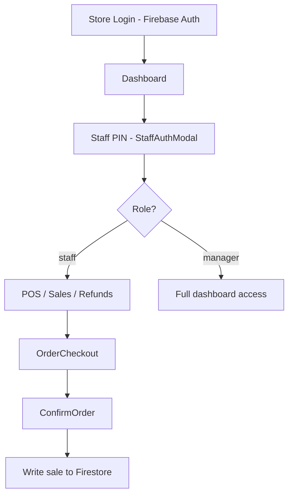

# iBean — Architecture & Documentation

A comprehensive reference for the iBean Point of Sale (POS) and management system used at Chillzone coffee shops.

---

## Overview

**iBean** is a web-based POS and back-office application for coffee shop staff and managers. It runs in the browser, authenticates each store device via Firebase Auth, and authorizes individual employees via a 4-digit PIN stored in Firestore.

| Item | Detail |
| --- | --- |
| **Project** | iBean POS |
| **Business** | Chillzone (inside iClick Business Centre, South Africa) |
| **Currency** | South African Rand (ZAR) |
| **Deployment** | Vercel |
| **Region context** | ZAR pricing, local store branches |

---

## Technology Stack

| Layer | Technology | Version (target) |
| --- | --- | --- |
| Framework | Next.js (App Router) | 16.x |
| UI | React | 19.x |
| Styling | Tailwind CSS v4 | 4.x |
| Database | Cloud Firestore | — |
| Authentication | Firebase Authentication | — |
| SDK | Firebase JS SDK | 12.x |
| PDF / Reports | `@react-pdf/renderer`, `jspdf` | — |
| AI Assistant | Google Gemini (`@google/generative-ai`) | — |

### Key conventions

- **Components**: Functional components with React Hooks. Client components use `'use client';` at the top.
- **Styling**: Tailwind utility classes in JSX. Global styles and animations live in `app/globals.css` with `@import "tailwindcss"`.
- **Firebase access**: Always import the configured Firestore instance from `@/utils/firebase`. Do not use Firebase Realtime Database.
- **Async operations**: All Firestore calls use `async/await` inside `try/catch` blocks.
- **Currency**: Calculate with numbers; use `.toFixed(2)` only for display.
- **Naming**: Components in `PascalCase`, variables/functions in `camelCase`.

---

## Directory Structure

```
ibean/
├── app/
│   ├── page.jsx                 # Root landing / store login redirect
│   ├── layout.js                # Root layout
│   ├── globals.css              # Tailwind import + custom utilities
│   ├── components/              # Shared UI (POS, modals, guards, etc.)
│   └── dashboard/               # Authenticated app pages
│       ├── layout.jsx           # Dashboard shell (sidebar, auth)
│       ├── page.jsx             # Homepage (AI assistant)
│       ├── sales/
│       ├── refunds/
│       ├── products/
│       ├── categories/
│       ├── specials/
│       ├── vouchers/
│       ├── staff/
│       ├── reports/
│       └── store-account/
├── utils/
│   ├── firebase.js              # Firebase app, auth, Firestore init
│   ├── storeId.js               # Canonical store email + legacy uid matching
│   ├── stores.js                # Chillzone store list for reports
│   ├── pricing/                 # Order totals, specials, sale builder, net reports
│   └── reportCalculations.js    # Report helpers (delegates product totals to pricing/)
├── .cursorrules                 # AI assistant project rules
└── .github/instructions/        # Copilot / IDE instructions
```

### Routing

- **`app/page.jsx`** — Store-level Firebase Auth gate.
- **`app/dashboard/*`** — POS and management pages after store login.
- **`app/components/*`** — Shared UI: `Login`, `Products`, `OrderCheckout`, `ConfirmOrder`, `RouteGuard`. Staff PIN modal lives in `dashboard/layout.jsx`.

---

## Authentication & Authorization

The app uses a **two-tier** security model.

### Tier 1 — Store / device login

- Each physical store has a dedicated Firebase Auth account (email/password).
- Accounts are created manually in the Firebase console.
- Authenticates the **device/register instance**, not the employee.
- Implemented in `app/components/Login.jsx` and checked on `app/page.jsx`.

### Tier 2 — Staff shift login

- After store auth, employees enter a **4-digit PIN**.
- PIN is validated against the Firestore `staff` collection.
- On success, session data is stored in `localStorage` as `staffAuth` with a **5-minute expiry**.
- `StaffAuthModal` handles PIN entry; `RouteGuard` enforces role-based access.

### Roles & privileges

| Role (`accountType`) | Access |
| --- | --- |
| `staff` | POS, Sales, Refunds, Store Account |
| `manager` | Everything staff has, plus Products, Categories, Specials, Staff Management, Reports |

Firestore security rules authenticate at the **store** level (`request.auth != null`). Employee role checks are enforced **client-side** via `RouteGuard`.

---

## Application Layout

- Collapsible sidebar (left) + main content (right).
- Dark-mode Tailwind styling throughout.

### Dashboard pages

| Page | Purpose |
| --- | --- |
| Homepage | AI assistant (Gemini-powered) |
| Sales | POS checkout and order flow |
| Refunds | Process refunds |
| Products | Product catalog (manager) |
| Categories | Category management (manager) |
| Specials | Discount/promotion rules (manager) |
| Vouchers | Loyalty and store vouchers |
| Staff | Staff accounts and PINs (manager) |
| Reports | Sales analytics and PDF exports (manager) |
| Store Account | Store profile and sign-out |

---

## Data Model (Firestore)

All collections are queried/written through `@/utils/firebase` (`db` export).

### `products`

| Field | Type | Notes |
| --- | --- | --- |
| `name` | string | Product name |
| `description` | string? | Optional |
| `category` | string | Category name |
| `price` | number? | Single price products |
| `varietyPrices` | map? | e.g. `{ "Short": 25, "Tall": 30 }` |
| `storeId` | string? | Optional audit: who created it — **catalog is shared across all stores** |
| `createdBy` / `updatedBy` | map | Audit: `id`, `name`, `role` |
| `createdAt` / `updatedAt` | timestamp | Server timestamps |

### `categories`

`name`, `description?`, `active`, `varieties[]`, `order`, `storeId?`, audit fields.

### `specials`

Promotion rules: triggers, rewards, discount types, date range, `mutuallyExclusive`, `storeId` (email). Evaluation: `utils/pricing/applySpecials.js`.

### `sales`

`staffId`, `staffName`, `date`, `storeId`, `items[]`, `appliedSpecials?`, `subtotalBeforeDiscounts`, `totalDiscount`, `total` (net paid), `voucher?`, `payment`.

**Reporting:** `items[].subtotal` remains list price × qty; net revenue uses `sale.total` with pro-rata allocation via `utils/pricing/` (`allocateNetToLineItems`, `aggregateProductPaymentTotals`). New sales are built with `buildSaleDocument()`.

### `refunds`

`productName`, `amount`, `reason`, `method`, `staffName`, `date`, `storeId`, `createdBy`.

### `vouchers`

`name`, `code`, `active`, `redeemed`, `voucherType`, `discountType`, `discountValue`, balance fields, redemption history, expiration, store restrictions.

### `staff`

`name`, `code` (4-digit PIN), `dob`, `accountType` (`staff` \| `manager`), `active`.

---

## Firestore Security Rules

```javascript
rules_version = '2';

service cloud.firestore {
  match /databases/{database}/documents {

    match /products/{docId} { allow read: if request.auth != null; }
    match /categories/{docId} { allow read: if request.auth != null; }
    match /specials/{docId} { allow read: if request.auth != null; }

    match /staff/{staffId} {
      allow read: if request.auth != null;
    }

    match /vouchers/{voucherId} {
      allow read: if request.auth != null;
      allow update: if request.auth != null;
    }

    match /sales/{saleId} {
      allow create: if request.auth != null;
    }
    match /refunds/{refundId} {
      allow create: if request.auth != null;
    }

    // Manager writes enforced client-side via RouteGuard
    match /products/{docId} { allow write: if request.auth != null; }
    match /categories/{docId} { allow write: if request.auth != null; }
    match /specials/{docId} { allow write: if request.auth != null; }
    match /vouchers/{voucherId} { allow create, delete: if request.auth != null; }
    match /staff/{staffId} { allow write: if request.auth != null; }
  }
}
```

---

## AI Assistant Context

The dashboard homepage embeds a Gemini-powered assistant with pre-loaded context:

- **Identity**: AI assistant for Chillzone's iBean POS.
- **Tone**: Helpful, professional, occasionally snarky.
- **Output**: Rich HTML with inline styles (dark-mode friendly).
- **Role-aware**: Responses differ for `manager` vs `staff`.

### Key personnel

| Name | Role |
| --- | --- |
| Candice (Candi) | Business owner |
| Christiaan | Manager (Zevenwaght Mall) & developer |
| Nico | Manager (Westgate Mall) |

---

## Environment Configuration

Create `.env.local` in the project root:

```env
NEXT_PUBLIC_FIREBASE_API_KEY="your-api-key"
NEXT_PUBLIC_FIREBASE_AUTH_DOMAIN="your-project-id.firebaseapp.com"
NEXT_PUBLIC_FIREBASE_PROJECT_ID="your-project-id"
NEXT_PUBLIC_FIREBASE_STORAGE_BUCKET="your-project-id.appspot.com"
NEXT_PUBLIC_FIREBASE_MESSAGING_SENDER_ID="your-messaging-sender-id"
NEXT_PUBLIC_FIREBASE_APP_ID="your-app-id"
NEXT_PUBLIC_GEMINI_API_KEY="your-gemini-api-key"
```

---

## Development

```bash
npm install
npm run dev      # http://localhost:3000
npm run build    # Production build
npm run lint     # ESLint
```

### Requirements

- Node.js 20.9+
- npm

---

## POS Flow (high level)



---

## Maintenance Notes

- **Active hardening work:** track status in [`TIGHTENING_TRACKER.md`](./TIGHTENING_TRACKER.md) (security, `storeId`, sessions, Firestore rules, domain-layer direction).
- **Design target:** shared pricing/order logic in `utils/pricing/` (not duplicated in UI); store raw transactional fields; calculate money in cents — see tracker section *Architecture direction*.
- Keep `.cursorrules`, this file, and `.github/instructions/projectinfo.instructions.md` in sync when architecture or conventions change.
- Indexed collections: `products`, `categories`, `sales`, `staff`, `vouchers`, `specials`, `refunds`.
- When adding features not covered here, update this document and ask for clarification on business rules.
